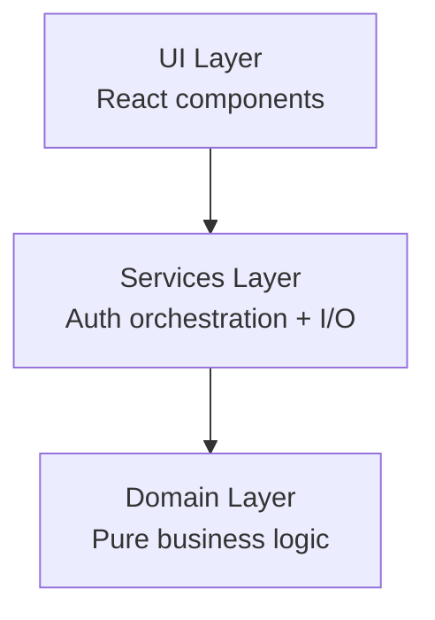

# Layer 2 Auth Architecture (Hub)

## Dependency Direction



- Allowed: `UI -> Services -> Domain`
- Forbidden: `Domain -> Services`, `Domain -> UI`
- Domain modules are pure TypeScript and can run headless in unit tests.

## Module Boundaries

### Domain (`packages/hub/src/domain/auth`)
- `User.ts`: user entity, password validation, license ownership checks
- `License.ts`: license validity and expiry rules
- `AuthError.ts`: domain error taxonomy for auth flows
- `types.ts`: domain-level identifiers and interfaces

Rules:
- No React imports
- No Tauri imports
- No filesystem/network side effects

### Services (`packages/hub/src/services/auth`)
- `AuthService.ts`: orchestrates login, local license persistence, token refresh
- `AuthApiClient.ts`: HTTP client for `https://api.antiphon.com/auth/*`
- `LicenseStore.ts`: Tauri filesystem persistence for license JSON files
- `types.ts`: service dependency contracts and DTOs

Rules:
- Own all external dependencies (HTTP, filesystem, runtime adapters)
- Convert infrastructure failures into domain auth errors
- Inject dependencies for integration-style testing

### UI (`packages/hub/src/ui/components`)
- `LoginForm.tsx`: capture credentials and emit success/error events
- `AuthLayout.tsx`: auth page shell
- `ErrorMessage.tsx`: present user-friendly auth errors

Rules:
- Presentation only
- Emits events (`onLogin`, `onError`)
- No business rules embedded in components

## Example Usage

```ts
import { AuthService } from '../services/auth/AuthService';
import { HttpAuthApiClient } from '../services/auth/AuthApiClient';
import { TauriLicenseStore } from '../services/auth/LicenseStore';

const authService = new AuthService(
  new TauriLicenseStore(),
  new HttpAuthApiClient(),
);

const user = await authService.authenticate(email, password);
const canLaunch = await authService.validateLicense(user.id, 'melody-engine');
```

## Testing Strategy

- Domain tests: pure unit tests with no mocks (`User.test.ts`, `License.test.ts`)
- Services tests: mocked `AuthApiClient` + `LicenseStore` to validate orchestration and error conversion (`AuthService.test.ts`)
- UI tests: React Testing Library verifies render/submit/loading/error behavior (`LoginForm.test.tsx`)

Validation checks:
- `pnpm test` for all suites
- `pnpm build` for workspace build
- `rg` checks to ensure domain has no React/Tauri imports
